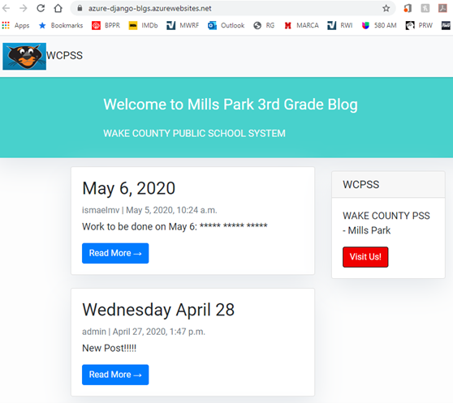

As a result of Coronavirus 19 (COVID-19), all Wake County schools in NC are closed. 
The Wake County Public School System (WCPSS) has moved the learning process online. 
The purpose of this project is to create a web app that can help students in the transition online, especially younger ones.
In order to help children, we have created a web app that will organize all the daily information they need and links to online resources in one place. 
The web app is simply a blog app that Mills Park Elementary students of early age can access without problems.

